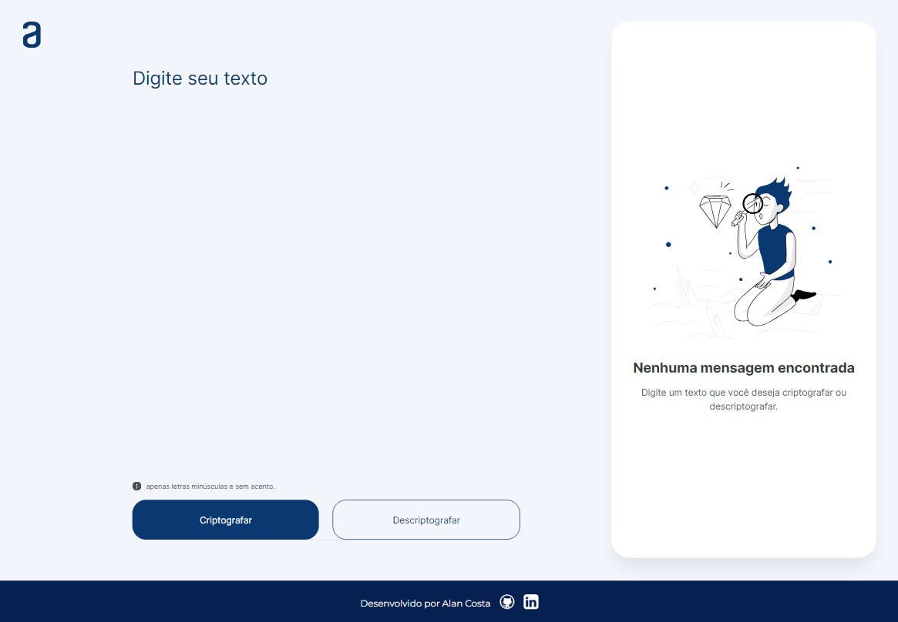
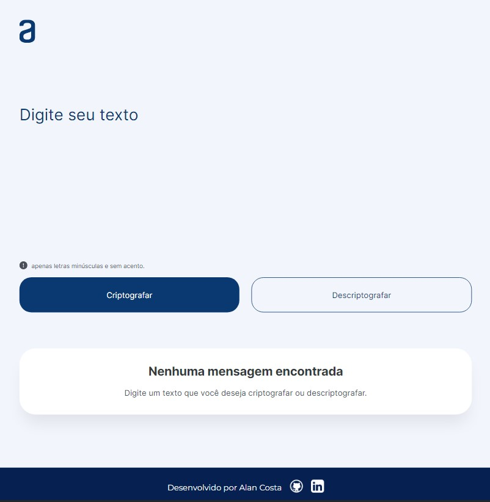
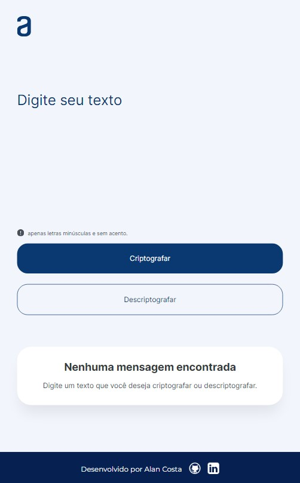

<h1 align="center" style="font-weight: bold;" id="top">Decodificador de Texto 💻    #challengeonedecodificador5 </h1>

 <a href="#layout">Layout</a> • 
 <a href="#technologies">Tecnologias</a>

    <b>O projeto foi criado em resposta ao desafio da Oracle T6 One, em parceria com a Alura. O desafio envolve a criação de um decodificador capaz de criptografar e descriptografar um texto. Foi disponibilizado um layout no Figma para este desafio.</b>

     <a href="https://alanrcosta.github.io/desafio-oracle/" target= "_blank">📱 Visite esse Projeto</a>

<h2 id="layout">🎨 Layout</h2>

    

    

    

<h2 id="technologies">💻 Tecnologias</h2>

- HTML
- CSS
- Javascript

 <a href="#top">Topo</a>

